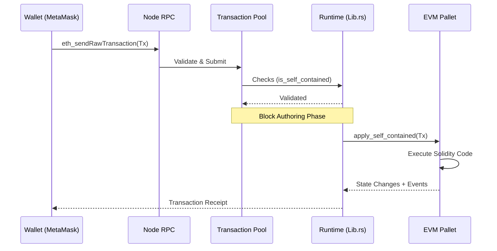

# India Chain: Cardano EVM Partner Chain

## System Overview
This repository contains a reference implementation of a Cardano Partner Chain node extended with full EVM compatibility. It serves as a foundational layer for building sovereignty-preserving sidechains that bridge the Cardano settlement layer with the Ethereum developer ecosystem.

### Architectural Diagram

```mermaid
graph TD
    subgraph "Cardano Mainnet"
        L1[Settlement & Security Layer]
    end

    subgraph "Partner Chain Node"
        Consensus[Substrate Consensus<br/>(Aura / Grandpa)]
        RPC[JSON-RPC Interface<br/>(HTTP / WS)]
        
        subgraph "Runtime"
            Executive[Runtime Executive]
            EVM[EVM Pallet<br/>(Frontier)]
            System[System Pallet]
        end
        
        RPC --> Executive
        Executive --> EVM
        Executive --> System
        EVM --> StateDB[(EVM State DB)]
        System --> BlockDB[(Block Storage)]
    end

    User[User / DApp] -->|Eth Transactions| RPC
    Dev[Developer] -->|Deploy Contract| RPC
    
    Consensus -.->|Anchor State| L1
```

---

## Process Flow: Transaction Lifecycle

The following diagram illustrates how an Ethereum-formatted transaction is processed by the Partner Chain node using the `fp_self_contained` architecture.



---

## Operational Runbook

### 1. System Requirements
*   **OS**: Linux (Ubuntu 22.04+ recommended)
*   **Rust**: Stable toolchain
*   **Ports**: `9944` (RPC/WS), `30333` (P2P)

### 2. Startup Procedures

**Development Mode (Ephemeral State)**
Ideal for testing and iteration. State is cleared on shutdown.
```bash
./target/release/partner-chains-demo-node --dev
```

**Production Mode (Persistent State)**
Retains chain data across restarts.
```bash
./target/release/partner-chains-demo-node --dev --base-path /data/chains/india-chain
```

### 3. Network Configuration
| Parameter | Value | Description |
| :--- | :--- | :--- |
| **RPC Endpoint** | `http://127.0.0.1:9944` | Standard JSON-RPC interface |
| **Chain ID** | `1337` | EIP-155 Replay Protection ID |
| **Token Symbol** | `TEST` | Native currency symbol |

---

## Documentation Registry

| Document | Description |
| :--- | :--- |
| **[Architecture & Capabilities](./CAPABILITIES.md)** | Detailed overview of the hybrid Substrate/EVM architecture and use cases. |
| **[Build Summary](./BUILD_SUMMARY.md)** | Technical audit of runtime modifications and dependency injections. |
| **[EVM Technical Guide](./EVM.md)** | comprehensive reference for RPC methods, deployment flows, and metadata handling. |
| **[Operational Runbook](./RUNBOOK.md)** | Extended procedures for maintenance, debugging, and health checks. |
| **[Credentials](./CREDENTIALS.md)** | Access keys for pre-funded development accounts. |

---

## Deployment Status
*   **EVM Compatibility**: Full (Frontier Layer)
*   **Consensus**: AuRa (Proof of Authority)
*   **Latest Build**: v1.0.0-rc1
